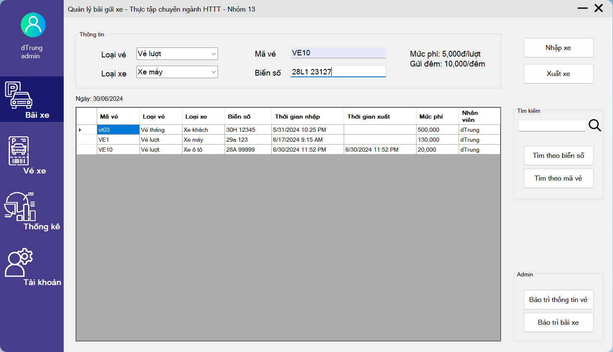
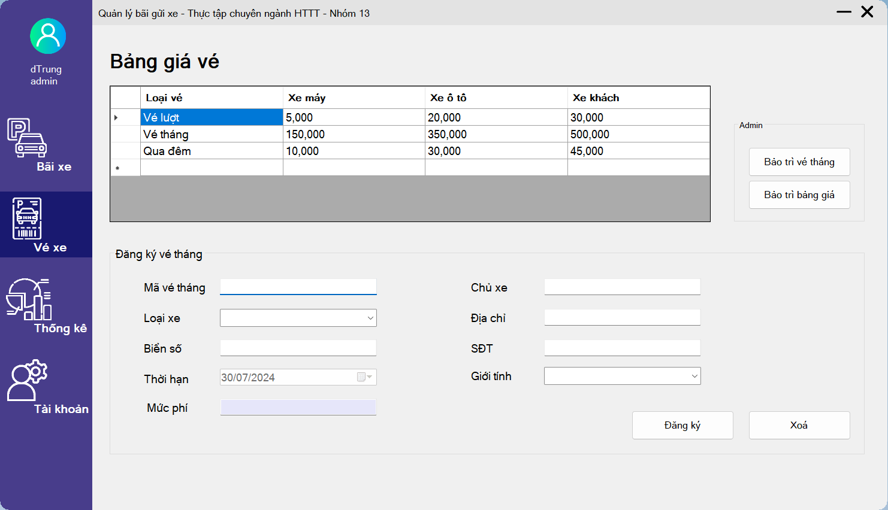
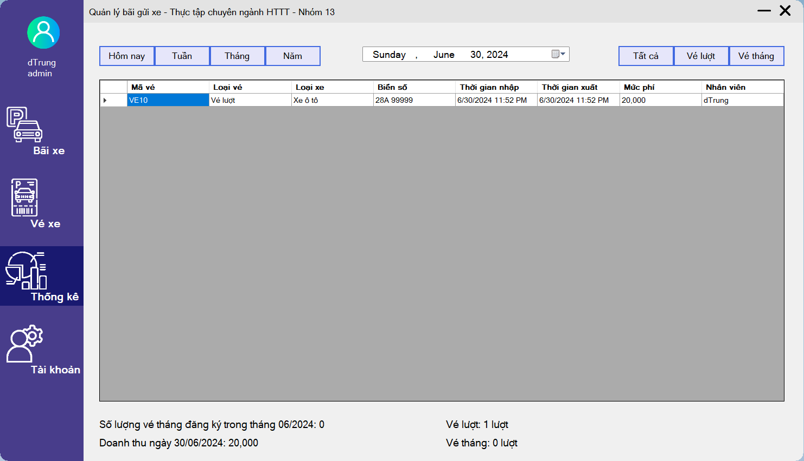
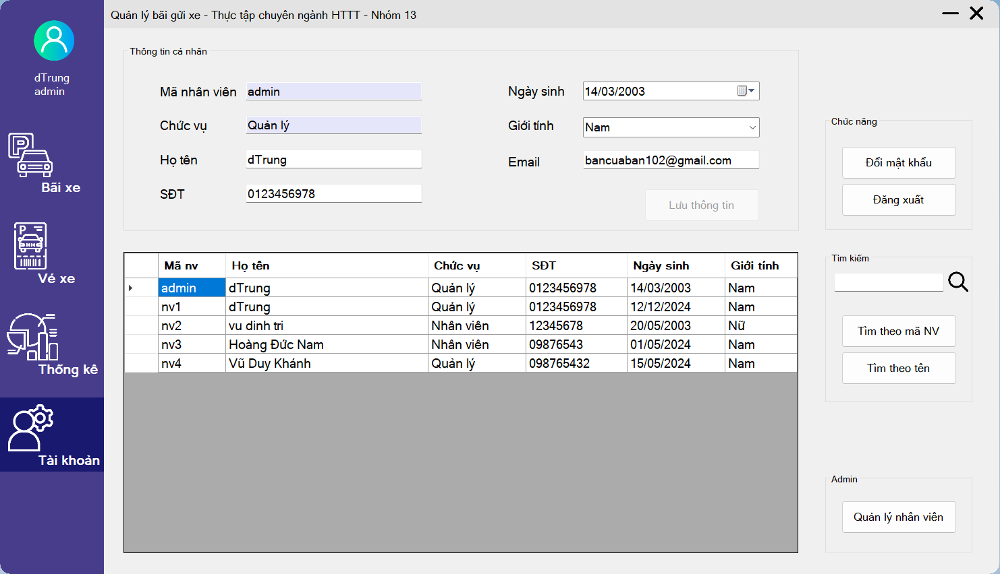

# JobsManagement
TTCN_Group13
- Hoàng Đức Nam
- Vũ Duy Khánh
- Vũ Đình Trí
- Đặng Đức Trung
## Giới thiệu
- Sản phẩm: ___Phần mềm quản lý bãi gửi xe___
- Cấu trúc: 
    - Phần mềm sử dụng Entity Framework
    - Ngôn ngữ C# Winform
    - Database SQL Server
    
## Giao diện & chức năng chính
* Giao diện bãi xe
  
* Giao diện vé xe
  
* Giao diện thống kê
  
* Giao diện tài khoản
  
## Các tính năng
- Quản lý xe ra vào bãi theo từng loại xe (xe máy, xe ô tô, xe khách)
- Thay đổi kích thước bãi xe, bảng giá vé
- Quản lý vé tháng
- Thống kê doanh thu
- Gửi mail khôi phục để lấy lại mật khẩu
- Quản lý thông tin các tài khoản (Admin)
   
